# Integrating Cipher with Cascade via MCP

This guide shows how to integrate Cipher as an MCP server with Cascade, allowing you to use Cascade's model selection while gaining persistent memory capabilities.

## Overview

- **Cipher** runs as an MCP server providing memory and knowledge management tools
- **Cascade** acts as the MCP client, using its own model selection and API keys
- **Benefits**: Persistent memory, knowledge graphs, session management without separate API keys

## System Architecture

```mermaid
graph TB
    subgraph "User Environment"
        U["👤 User"] --> C["🌊 Cascade (Windsurf)"]
    end
    
    subgraph "MCP Integration Layer"
        C --> MCP["📡 MCP Protocol"]
        MCP --> CS["🧠 Cipher MCP Server"]
    end
    
    subgraph "Cipher Internal Components"
        CS --> CM["💾 Cipher Memory Agent"]
        CM --> OL["🦙 Ollama (llama3.2:1b)"]
        CM --> QD["🗄️ Qdrant Vector DB"]
        CM --> KG["🕸️ Knowledge Graph"]
    end
    
    subgraph "Local Services (Docker/Brew)"
        QD --> QC["🐳 Qdrant Container<br/>Port 6333"]
        OL --> OS["🍺 Ollama Service<br/>Port 11434"]
    end
    
    subgraph "Data Flow"
        U -.->|"1. User Query"| C
        C -.->|"2. MCP Tool Call"| CS
        CS -.->|"3. Memory Search/Store"| CM
        CM -.->|"4. Vector Operations"| QD
        CM -.->|"5. LLM Processing"| OL
        CM -.->|"6. Knowledge Relations"| KG
        CS -.->|"7. Response"| C
        C -.->|"8. Enhanced Answer"| U
    end
    
    style C fill:#4A90E2,color:#fff
    style CS fill:#7ED321,color:#fff
    style CM fill:#F5A623,color:#fff
    style QD fill:#D0021B,color:#fff
    style OL fill:#9013FE,color:#fff
    style KG fill:#50E3C2,color:#fff
```



### Component Roles

- **🌊 Cascade**: Primary AI interface, handles user interactions and model selection
- **🧠 Cipher MCP Server**: Provides memory tools via MCP protocol
- **💾 Memory Agent**: Core logic for storing/retrieving knowledge
- **🦙 Ollama**: Local LLM for internal processing (no API keys needed)
- **🗄️ Qdrant**: Vector database for semantic search
- **🕸️ Knowledge Graph**: Relationship mapping between concepts

## Setup Steps

### 1. Start Qdrant Vector Database
```bash
# Already running, but if you need to restart:
docker start cipher-qdrant
# Or if container doesn't exist:
docker run -d -p 6333:6333 -p 6334:6334 -v $(pwd)/qdrant_storage:/qdrant/storage --name cipher-qdrant qdrant/qdrant
```

### 2. Start Ollama Service

```bash
# Start Ollama (if not already running)
brew services start ollama

# Verify Ollama is running
curl http://localhost:11434/api/tags
```

### 3. Configure Cascade MCP Settings

Add this to your Windsurf MCP server configuration:

```json
{
  "mcpServers": {
    "cipher": {
      "command": "cipher",
      "args": ["--mode", "mcp"],
      "env": {
        "OLLAMA_BASE_URL": "http://localhost:11434",
        "VECTOR_STORE_TYPE": "qdrant",
        "VECTOR_STORE_HOST": "localhost",
        "VECTOR_STORE_PORT": "6333",
        "VECTOR_STORE_URL": "http://localhost:6333"
      }
    }
  }
}
```

**Note**: Windsurf MCP format doesn't support `"type"` or `"cwd"` properties.

### 4. Available Cipher Tools in Cascade

Once connected, Cascade will have access to these Cipher tools:

- `cipher_search_memory` - Search stored memories and knowledge
- `cipher_extract_and_operate_memory` - Extract and store knowledge from conversations
- `cipher_session_management` - Manage conversation sessions
- `cipher_knowledge_graph` - Query and update knowledge graphs

### 5. Usage Examples

**Store Information:**
```text
@cipher Please remember that I prefer React with TypeScript for frontend projects
```

**Search Memory:**
```text
@cipher What do you remember about my frontend preferences?
```

**Session Management:**
```text
@cipher Create a new session for the "E-commerce Project"
```

## Benefits of This Integration

1. **No External API Costs** - Uses local Ollama + Cascade's model selection
2. **Persistent Memory** - Information persists across Cascade sessions
3. **Knowledge Graphs** - Builds relationships between concepts
4. **Session Management** - Organize conversations by project/topic
5. **Vector Search** - Semantic search through stored knowledge
6. **Privacy-First** - All memory processing happens locally

## Troubleshooting

- **Qdrant**: Ensure running with `curl http://localhost:6333/`
- **Ollama**: Verify with `curl http://localhost:11434/api/tags`
- **Cipher MCP logs**: Check `/var/folders/.../cipher-mcp.log`
- **Config files**: Must exist in both root and `dist/` directories
- **Model**: Ensure `llama3.2:1b` is pulled with `ollama list`

## Current Configuration Summary

- **Cipher**: v0.2.0 installed from source
- **Vector DB**: Qdrant running on port 6333
- **LLM**: Ollama with llama3.2:1b model
- **Integration**: MCP mode with Windsurf-compatible config
- **Memory**: Persistent storage with knowledge graphs

## Advanced Configuration

Customize the system prompt in `cipher.yml` to tailor Cipher's behavior for your specific use cases. The current setup uses local Ollama for internal operations while Cascade handles primary AI interactions.
